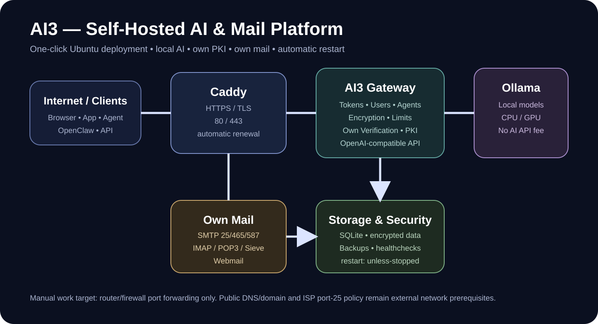

# AI3 — eigener universeller KI-, Agent- und API-Gateway

AI3 ist ein selbst gehostetes Gateway für lokale KI-Modelle, KI-Agenten, Benutzer und OpenAI-kompatible Anwendungen. **Branding: xDarkixx. Copyright © 2026 xDarkixx.** Der Standardstack benötigt keinen kostenpflichtigen KI-API-Anbieter.



## 🚀 Ziel: One-Click-Betrieb

Auf Ubuntu 24.04 LTS ist der Zielablauf:

1. Repository bereitstellen.
2. `scripts/install-ubuntu.sh` ausführen.
3. Router/Firewall-Portweiterleitungen einmalig auf diesen PC setzen.
4. AI3 startet selbstständig und überwacht seine LAN-Adresse.

Der Installer installiert Docker/Compose, erkennt NVIDIA-GPUs, richtet Ollama und das lokale Modell ein, erzeugt Secrets, startet AI3/Caddy/Mail, richtet den automatischen LAN-Watcher ein, prüft die Dienste und erzeugt die OpenClaw-Konfiguration.

```bash
chmod +x scripts/install-ubuntu.sh
./scripts/install-ubuntu.sh
```

Alle produktiven Container verwenden `restart: unless-stopped`, damit sie nach einem Docker-/Host-Neustart automatisch wieder anlaufen.

## 🔄 Automatische Netzwerk-Selbstheilung

AI3 benötigt keine fest eingetragene LAN-IP. `scripts/network-refresh.sh` erkennt automatisch PC-Name, aktuelle IPv4, Netzwerkinterface und Gateway. Ein systemd-Dienst aktualisiert die Identität beim Boot; ein Timer prüft sie anschließend regelmäßig. systemd-Timer sind dafür als periodische Aktivierung von Services vorgesehen. citeturn0search0

Wenn der Router beispielsweise DHCP neu vergibt und der PC von `192.168.178.50` auf `192.168.178.73` wechselt, aktualisiert AI3 automatisch die gespeicherte LAN-IP und bei Bedarf nur Caddy. Ollama, Datenbank und die übrigen AI3-Dienste müssen dafür nicht neu gestartet werden.

Im Diagnosebereich werden PC-Name, aktuelle IP und das erforderliche Router-Ziel angezeigt:

```text
PC-Name:        AI3-PC
Aktuelle IP:    192.168.178.73
Router-Ziel:    TCP 80/443 -> 192.168.178.73

[ Router öffnen ]
[ Anleitung anzeigen ]
```

**Router-Portfreigaben werden absichtlich nicht automatisch verändert.** Du wählst im Router einmal den AI3-PC als Zielgerät und leitest die benötigten Ports weiter. AI3 verändert weder Router-Einstellungen noch öffnet selbstständig zusätzliche Ports.

Für besonders stabile Heimnetze ist eine DHCP-Reservierung für den AI3-PC weiterhin empfehlenswert; die automatische Erkennung bleibt trotzdem aktiv, falls sich die Adresse unerwartet ändert.

## 🔐 Automatisches HTTPS

Caddy übernimmt HTTPS und die automatische Zertifikatsverwaltung. Bei einem öffentlichen Domainnamen werden ACME-Zertifikate automatisch bezogen und erneuert; für `localhost`/interne Namen kann Caddy eine lokale CA verwenden. Für öffentliches HTTPS müssen DNS sowie Ports 80 und 443 auf den Server zeigen. citeturn0search1turn0search2

## ✉️ Eigener Mailserver

AI3 startet einen eigenen Mailserver ohne SMTP-Relay-Anbieter. Maildienste laufen im Host-Netzwerk, damit die echten Client-IP-Adressen für Spam-/Relay-Schutz erhalten bleiben. Der Webzugriff wird über Caddy bereitgestellt.

Ports:

- SMTP: `25`
- SMTPS: `465`
- Submission: `587`
- IMAP: `143` / `993`
- POP3: `110` / `995`
- Sieve: `4190`

Für echte öffentliche E-Mail-Zustellung sind zusätzlich eine öffentliche IP, korrektes PTR/rDNS und vollständige DNS-Verwaltung der Domain erforderlich. Port 25 kann der Router/Firewall weiterleiten, aber eine Sperre des Internetproviders kann AI3 nicht softwareseitig aufheben.

## 🪪 Eigene Verifizierung

Die Identitätsprüfung bleibt vollständig bei AI3. Es wird kein eID-, EUDI- oder kommerzieller KYC-Anbieter benötigt. AI3 kann verschlüsselte Nachweise verwalten und Prüfungen als `pending`, `verified` oder `rejected` führen.

Eine eigene Host-Prüfung ist **keine staatliche Identitätsbestätigung**.

## 🤖 Lokale KI

Ollama läuft lokal und AI3 benötigt für die Inferenz keinen externen KI-API-Anbieter. Modelle werden beim Setup automatisch geladen. CPU und kompatible NVIDIA-GPUs werden unterstützt.

## 🔌 API

- `GET /v1/models`
- `POST /v1/chat/completions`
- `POST /v1/responses`
- `POST /v1/embeddings`

Damit können Apps, Bots und Agenten AI3 als eigenen OpenAI-kompatiblen Provider verwenden.

## 🖥️ Weboberfläche

Das Control Center bündelt:

- AI3-Systemstatus
- KI-/Ollama-Status
- Token- und Benutzerverwaltung
- Agentenverwaltung
- PKI und Zertifikate
- Own Verification
- Mailserver
- HTTPS
- Backups
- Sicherheitsstatus
- Netzwerkstatus und LAN-IP
- Diagnose/Healthchecks

## 🔏 Eigene PKI

AI3 erzeugt seine eigene Root-CA und kann interne Server-, Client- und Agent-Zertifikate ausstellen und widerrufen. Die CA ist eine private Vertrauensdomäne und ersetzt nicht das öffentlich vertrauenswürdige HTTPS von Caddy.

## 💾 Daten & Backups

Daten, Chats und Profile können verschlüsselt gespeichert werden. Persistente Docker-Volumes sorgen dafür, dass Daten Neustarts und Container-Neuerstellungen überleben. Backups werden lokal vorgesehen, ohne einen Cloud-Anbieter vorauszusetzen.

## 💰 Kostenmodell

Der Standardbetrieb ist auf **0 € für externe KI-, KYC-, SMTP- und Zertifikatsanbieter** ausgelegt. Es bleiben nur Infrastrukturkosten wie eigene Hardware, Strom, Internet und gegebenenfalls eine eigene Domain. Eine öffentliche Domain und deren DNS können nicht von einer lokalen Software kostenlos erfunden werden.

## 🛡️ Sicherheitsmodell

Enthalten sind unter anderem Token-Scopes, Ablaufzeiten, Admin-Sessions, Verschlüsselung, Rate-Limits, IP-/Concurrency-Schutz, HTTP-Sicherheitsheader, eigene PKI, Zertifikatswiderruf und lokale Backups.

Für einen öffentlichen Server muss die Firewall weiterhin restriktiv betrieben werden. Ein Router kann die benötigten Ports auf den AI3-Server weiterleiten. AI3 übernimmt bewusst nicht die automatische Router-Konfiguration.

## 📦 Neustartverhalten

Nach erfolgreicher Erstinstallation ist kein manueller Start der Container notwendig. Docker wird beim Boot aktiviert und die AI3-Dienste besitzen automatische Restart-Regeln. Zusätzlich startet der LAN-Watcher beim Boot und prüft die Netzwerkidentität regelmäßig. citeturn0search0

## ⚠️ Was nicht automatisierbar ist

AI3 kann lokale Software, Zertifikate, Mailserver, Datenbanken, Modelle, Firewall-Regeln und Container automatisieren. Es kann jedoch nicht ohne passende Router-/Provider-Schnittstelle:

- einen Domainnamen besitzen,
- DNS beim Domainanbieter ohne dessen API-Zugang ändern,
- eine Router-Portweiterleitung außerhalb des Servers setzen,
- eine ISP-Sperre für Port 25 aufheben,
- eine öffentliche IP vom Internetanbieter bereitstellen.

Die LAN-IP des AI3-PCs wird dagegen automatisch erkannt und aktualisiert.
